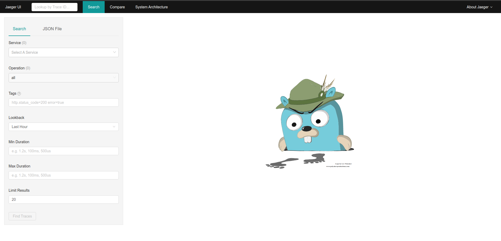

# Lab 1 - Installing Jaeger

The first laboratory of the workshop consist of launching a Kubernetes cluster in our local machine and install the [Jaeger Operator](https://github.com/jaegertracing/jaeger-operator). In order to achieve that, we will use [minikube](https://kubernetes.io/docs/tutorials/hello-minikube/) that eases a lot this task.

We will perform the following tasks:

1. Install and run a Minikube cluster in your laptop.
2. Use `kubectl` while deploying a sample application.
3. Deploy Jaeger.
4. Test Jaeger accessing its UI.

### Requirements

- 2 CPUs or more
- 8GB of free memory
- 40GB of free disk space
- Internet connection
- Container or virtual machine manager, such as: [Docker](https://docs.docker.com/engine/install/).

## 1. Installing Minikube

Depending of your OS, you will have different options for installing Minilube.

:::: tabs type:border-card

::: tab Linux

```sh
curl -LO https://storage.googleapis.com/minikube/releases/latest/minikube-linux-amd64
sudo mv minikube-linux-amd64 /usr/local/bin/minikube
sudo chmod a+x /usr/local/bin/minikube
```

:::

::: tab MacOs

If the [Brew Package Manager](https://brew.sh/) installed:

```sh
brew install minikube
```

If `which minikube` fails after installation via brew, you may have to remove the minikube cask and link the binary:

```sh
brew cask remove minikube
brew link minikube
```

Otherwise, download minikube directly:

```sh
curl -LO https://storage.googleapis.com/minikube/releases/latest/minikube-darwin-amd64
sudo install minikube-darwin-amd64 /usr/local/bin/minikube
```

:::

::: tab Windows

If the [Chocolatey Package Manager](https://chocolatey.org/) is installed, use it to install minikube:

```sh
choco install minikube
```

Otherwise, download and run the [Windows installer](https://storage.googleapis.com/minikube/releases/latest/minikube-installer.exe)

:::

::::

## 2. Starting the cluster

From a terminal with administrator access (but not logged in as root), run:

```sh
minikube start --cpus 2 --memory 8192 --disk-size 40g --addons=ingress
```

## 3. Interacting with K8s

If you already have kubectl installed, you can now use it to access your shiny new cluster:

```sh
kubectl config use-context minikube
kubectl get po -A
```

Alternatively, minikube can download the appropriate version of kubectl, if you don't mind the double-dashes in the command-line:

```sh
alias kubectl="minikube kubectl --"
kubectl -- get po -A
```

minikube bundles the Kubernetes Dashboard, allowing you to get easily acclimated to your new environment:

```sh
minikube dashboard
```

## 4. Deploying a sample application

Create a sample deployment and expose it on port 8080:

```sh
kubectl create deployment hello-minikube --image=k8s.gcr.io/echoserver:1.4
kubectl expose deployment hello-minikube --type=NodePort --port=8080
```

It may take a moment, but your deployment will soon show up when you run:

```sh
kubectl get services hello-minikube
```

The easiest way to access this service is to let minikube launch a web browser for you:

```sh
minikube service hello-minikube
```

Alternatively, use kubectl to forward the port:

```sh
kubectl port-forward service/hello-minikube 7080:8080
```

Now, the application is available at [http://localhost:7080/](http://localhost:7080/)

## 5. Deleting minikube cluster

> For now, we will not execute this command.

```sh
minikube delete --all
```

## 6. Deploy Jaeger Operator

```sh
kubectl create namespace observability
kubectl create -f https://raw.githubusercontent.com/jaegertracing/jaeger-operator/master/deploy/crds/jaegertracing.io_jaegers_crd.yaml
kubectl create -n observability -f https://raw.githubusercontent.com/jaegertracing/jaeger-operator/master/deploy/service_account.yaml
kubectl create -n observability -f https://raw.githubusercontent.com/jaegertracing/jaeger-operator/master/deploy/role.yaml
kubectl create -n observability -f https://raw.githubusercontent.com/jaegertracing/jaeger-operator/master/deploy/role_binding.yaml
kubectl create -n observability -f https://raw.githubusercontent.com/jaegertracing/jaeger-operator/master/deploy/operator.yaml

kubectl create -f https://raw.githubusercontent.com/jaegertracing/jaeger-operator/master/deploy/cluster_role.yaml
kubectl create -f https://raw.githubusercontent.com/jaegertracing/jaeger-operator/master/deploy/cluster_role_binding.yaml
```

## 7. Deploy Jaeger instance

Now, we will deploy a in-memory all-in-one instance of Jaeger, suitable for this workshop.

- Deploy the instance:

    ```sh
    kubectl apply -n observability -f - <<EOF
    apiVersion: jaegertracing.io/v1
    kind: Jaeger
    metadata:
        name: "jaeger-workshop"
    EOF
    ```

- Check the instance:

    ```sh
    kubectl get jaegers -n observability
    kubectl get pods -n observability -l app.kubernetes.io/instance=jaeger-workshop
    
    ```

## 8. Validate deployment

To validate that Jaeger is working correctly, let’s forward its port and see if we can access the UI:

```sh
kubectl get -n observability ingress

K8S_INGRESS_IP=$(kubectl get -n observability ingress -o jsonpath='{.items[0].status.loadBalancer.ingress[0].ip}')
echo "http://$K8S_INGRESS_IP"
```

Now, the application is available at the link printed before.


