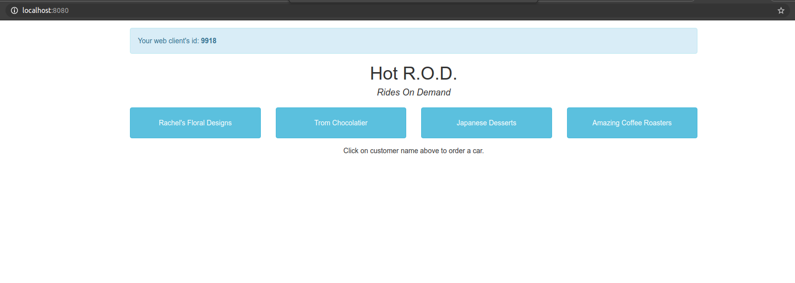
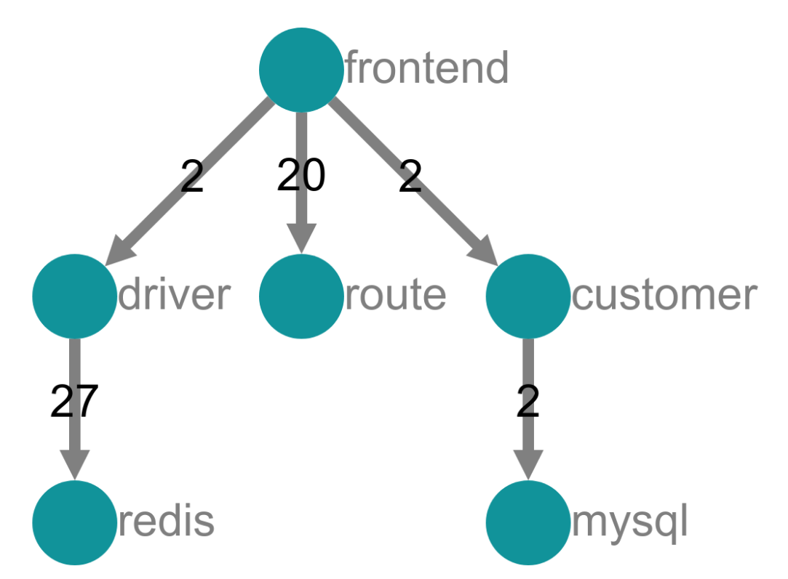
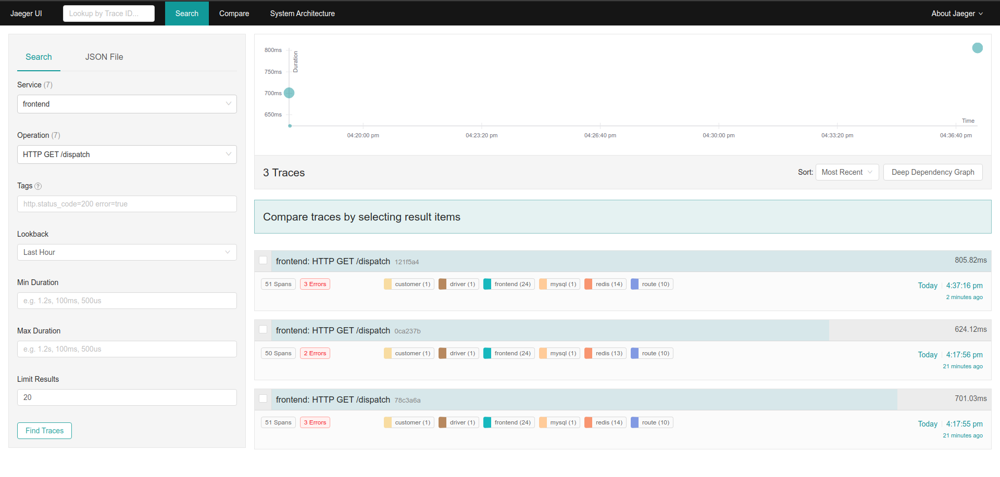
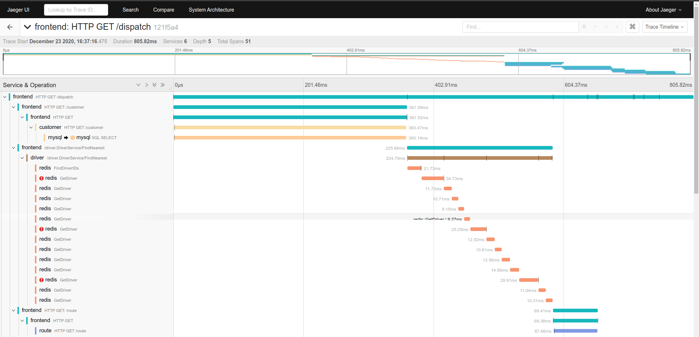
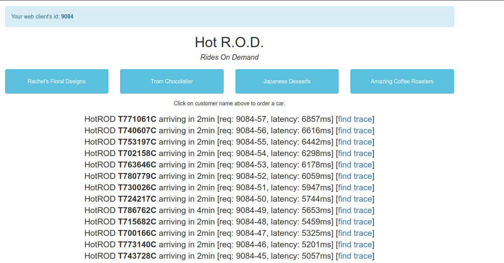
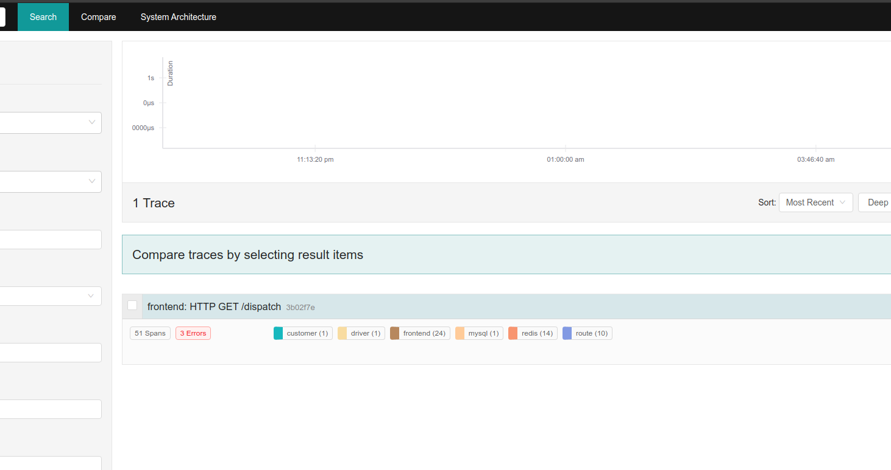
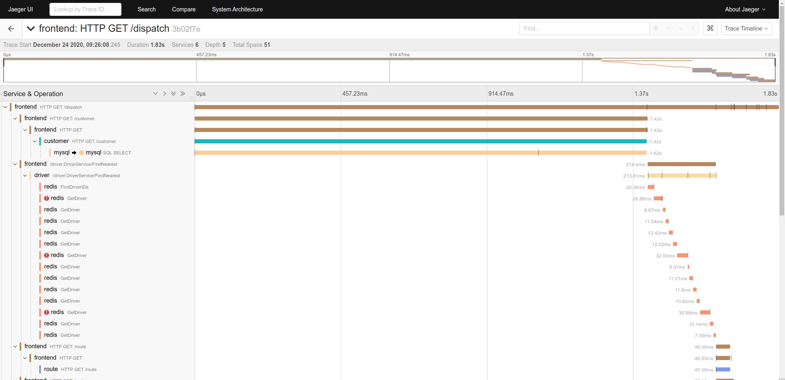
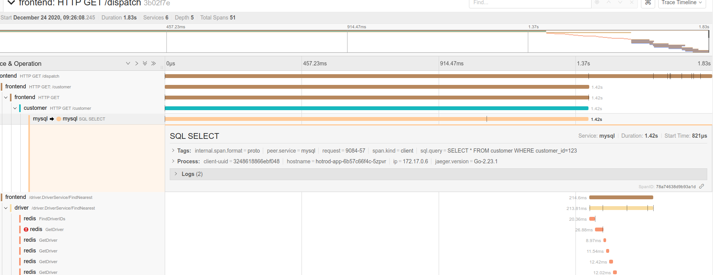

# Lab 2 - Using Jaeger

In the second laboratory of the workshop, we will install [HotROD (Rides on Demand)](https://github.com/jaegertracing/jaeger/tree/master/examples/hotrod) is a demo application that consists of several microservices and illustrates the use of the OpenTracing API. Afterwards, we will review most of the Jaeger features.

We will perform the following tasks:

1. Install HotROD in K8s.
2. Use the Jaeger UI
3. Obtain the data flow of an application.
4. Searching the source of a bottleneck using Jaeger.

## 1. Installing HotROD

1. Install HotROD:

    <<< @/docs/laboratory-02/files/hotrod_deployment.sh

2. Enable port forwarding:

    ```sh
    kubectl port-forward -n hotrod service/hotrod-service 8080:8080
    ```

3. Access HotROD, the application is available at [http://localhost:8080/](http://localhost:8080/)

## 2. Using HotROD

HotROD is a very simple "ride sharing" application.

In the home page we have four customers, and by clicking one of the four buttons we send a car to arrive to the customer’s location. Therefore a request for a car is sent to the backend, it responds with the car’s license plate number and the expected time of arrival:

There are a few bits of debugging information we see on the screen.



1. In the top left corner there is a ```web client id: 9323```. It is a random session ID assigned by Javascript UI; if we reload the page we get a different session ID.
2. In the line about the car we see a request ID ```req: 9323-1```. It is a unique ID assigned by Javascript UI to each request it makes to the backend, composed of the session ID and a sequence number.
3. The last bit of debugging data, ```latency: 782ms```, is measured by the Javascript UI and shows how long the backend took to respond.
4. This additional information has no impact on the behavior of the application, but will be useful when we look under the hood.

### Architecture



Hotrod is a very simple application composed of 6 microservices:

- 1 frontend microservices.
- 3 backend microservices which are called by the frontend.
- 2 storage backends.

The storage nodes are not actually real, they are simulated by the app as internal components, but the top four microservices are indeed real.

## 3. Understanding the Data Flow of an application

One of the main advantages of Distributed Tracing is that we are able to track a request through a software system that is distributed across multiple applications, services, and databases as well as intermediaries like proxies.

So, let’s find out the data flow of HotROD.

1. Access HotROD \([http://localhost:8080/](http://localhost:8080/)\) and click several times in some of the customers.
    
2. Go to the **Search** page in the **Jaeger UI**.
3. Select ```frontend``` in the **Service** drop-down list because is our root service and ```HTTP GET /dispatch``` in the **Operation** drop-down list to filter the dispatch action.
4. Click **Find Traces**.
    
5. Next, click in one of the traces on the right side.
    

Now, Jaeger showS the trace of one of our request and displays some meta-data about it, such as the names of different services that participated in the trace, and the number of spans each service emitted to Jaeger.

- The top level endpoint name is displayed in the title bar: ```HTTP GET /dispatch```.
- On the right side we see the total duration of the trace. This is shorter than the duration we saw in the HotROD UI because the latter was measured from the Browser.
- The timeline view shows a typical view of a trace as a time sequence of nested spans, where a span represents a unit of work within a single service. The top level span, also called the ```root``` span, represents the main HTTP request from Javascript UI to the ```frontend``` service, which in turn called the ```customer``` service, which in turn called a ```MySQL``` database.
- The width of the spans is proportional to the time the operation takes. It also represent the time waiting for other services calls.

Using that information we can generate the data flow of the request:

<mermaid>
graph TD
    B[/Browser\] --> |1| F[frontend];
    F[frontend] --> |2| C[customer];
    C[customer] ---> |3| M[(mysql)];
    F[frontend] --> |"4 [gRPC]"| D[driver];
    D[driver] -.-> |5| Re[(redis)];
    D[driver] --> |5| Re[(redis)];
    F[frontend] --> |6| Ro[route];
    F[frontend] --> |6| Ro[route];
    F[frontend] --> |6| Ro[route];
    F[frontend] --> |6| Ro[route];
    F[frontend] --> |7| B[/Browser\];
</mermaid>

1. A ```HTTP GET``` request are sent the to ```/dispatch``` endpoint  of the ```frontend``` service.
2. The ```frontend``` service makes a HTTP GET request to the ```/customer``` endpoint of the ```customer``` service.
3. The ```customer``` service executes an statement in the ```MySQL DB``` and those results are sent to the ```frontend``` service.
4. The ```frontend``` service makes a ```gRPC``` request ```Driver::findNearest``` to the driver service.
5. The ```driver``` service makes several calls to ```Redis```. Some of them are failures.
6. The ```frontend``` service executes many of ```HTTP GET``` requests to the ```/route``` endpoint of the ```route``` service.
7. The ```frontend``` service returns the result.

## 4. Searching the source of a bottleneck

Another cool feature of Distributed Tracing is that using its information we can find easily the bottlenecks of our system. In order to do that we are going to stress the system making so many calls and using Jaeger we are going to find out the root of the problem.

1. Access HotROD \([http://localhost:8080/](http://localhost:8080/)\) and click multiple times on the customers until the latency goes up very sharply.
    
2. Click in the first **find trace** link which it will take us to see the trace of the request in Jaeger.
    
3. Next, click in the ```HTTP GET /dispatch``` request to see a detailed view of its trace through the system.
    

Now, we are able to see what going on in the system:

1. As we mentioned before, the actual processing time is different that we saw in the HotROD web page. This is because the server is not able to handle all the request in time and it has to put them in a queue even before any span is generated.
2. The trace shows that the request was handle in almost 2 seconds.
3. Reviewing all the span, we can detect that the ```customer``` service call to ```mysql``` service is generating more that 70% of the processing time. This is our most promising **bottleneck** candidate.
4. Finally, we can click in the ```mysql``` service call to see more information about that specific **span**. Thanks that the developers added a custom tag ```sql.query``` we can identify very easily the SQL statement that is generating the problem.
  
