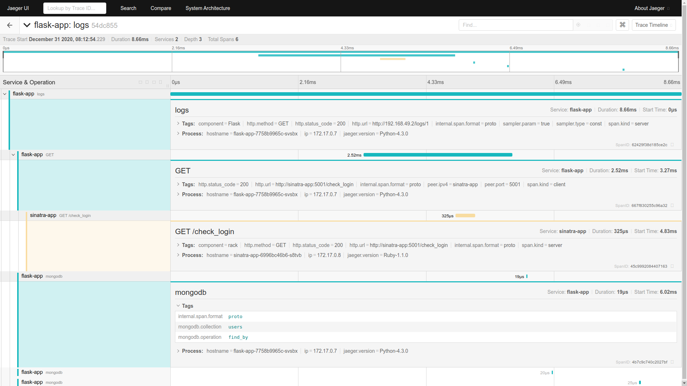

# Lab 3 - Integrating an app

In the last laboratory, we will learn how to modify a existing application in order to work with Jaeger. To cover different implementations of [Jaeger Client](https://www.jaegertracing.io/docs/1.21/client-libraries/#supported-libraries), it has been selected [dvoitekh/kubernetes-microservices](https://github.com/dvoitekh/kubernetes-microservices), a OSS *Simple Kubernetes-based app*, which contains 3 services:

1. [Flask (Python)](https://flask.palletsprojects.com/) microservice (management of applications' logs).
2. [Sinatra (Ruby)](http://sinatrarb.com/) microservice (OAuth server - user registration and login).
3. MongoDB

<mermaid>
graph TD
    A[/Browser\] --> |users| F[flask-app];
    A[/Browser\] --> |logs| F[flask-app];
    A[/Browser\] --> |applications| F[flask-app];
    A[/Browser\] --> |login| S[sinatra-app];
    F[flask-app] --> |check_login| S[sinatra-app];
    S[sinatra-app] ---> |find| M[(MongoDB)];
    S[sinatra-app] ---> |save| M[(MongoDB)];
    F[flask-app] --> |save| M[(MongoDB)];
    F[flask-app] --> |find| M[(MongoDB)];
</mermaid>

## 1. Install the application as is in K8s

Before anything else, we are going to install the application without any modification to check that works properly.

1. Clone the modified application repo:

    ```bash
    git clone https://github.com/alvsanand/kubernetes-microservices

    cd kubernetes-microservices
    ```

2. Build **flask-app** Docker image and upload to minikube:

    ```bash
    eval $(minikube docker-env)

    docker build -t flask-app flask-app
    ```

3. Build **sinatra-app** Docker image and upload to minikube:

    ```bash
    docker build -t sinatra-app sinatra-app
    ```

4. Install **kubernetes-microservices**:

    <<< @/docs/laboratory-03/files/kubernetes-microservices_deployment.sh

5. Test the application:

    <<< @/docs/laboratory-03/files/kubernetes-microservices_test.sh

6. Delete the application resources:

    ```bash
    kubectl delete namespace kubernetes-microservices
    ```

## 2. Integrating flask-app with Jaeger

Firstly, ```flask-app``` will be modified. Therefore, we will add the necessary code to application and the deployment configuration in order to work with Jaeger.

1. Add [Flask-OpenTracing](https://pypi.org/project/Flask-OpenTracing/) dependencies:

    <<< @/docs/laboratory-03/files/changes_flaskapp_requirements.sh

2. Modify **flask-app/config.py** adding ```JAEGER``` environment variables:

    <<< @/docs/laboratory-03/files/changes_flaskapp_config.py

3. Edit **flask-app/app/views.py** adding the Jaeger configuration to the Flask app:

    <<< @/docs/laboratory-03/files/changes_flaskapp_app_views.py

4. Modify **kubernetes/flask-deployment.yml** adding ```JAEGER``` environment variables:

    <<< @/docs/laboratory-03/files/changes_kubernetes_flask_deployment.yml

## 3. Integrating sinatra-app with Jaeger

Next, it is time to modify ```simatra-app```, the Ruby service. We will also add the necessary code to application and the deployment configuration in order to work with Jaeger.

1. Add [jaeger-client-ruby](https://github.com/salemove/jaeger-client-ruby) dependencies:

    <<< @/docs/laboratory-03/files/changes_sinatra_gemfile.sh

2. Edit **sinatra-app/app.rb** adding the Jaeger configuration to the Ruby app:

    <<< @/docs/laboratory-03/files/changes_sinatra_app.rb

3. Modify **kubernetes/sinatra-deployment.yml** adding ```JAEGER``` environment variables:

    <<< @/docs/laboratory-03/files/changes_kubernetes_flask_deployment.yml

## 4. Propagating the tracing HTTP headers

Now, we are able to trace all requests from the Python and Ruby services. However, the requests made from ```flask-app``` to ```sinatra-app``` are not correlated because the span is not propagated. To solve that, we have to modify again ```flask-app``` to do so.

1. Add [opentracing-instrumentation](https://pypi.org/project/opentracing-instrumentation/) dependency:

    <<< @/docs/laboratory-03/files/changes_flaskapp_requirements_2.sh

2. Edit **flask-app/app/views.py** adding the Jaeger configuration to the Flask app:

    <<< @/docs/laboratory-03/files/changes_flaskapp_app_views_2.py

## 5. Installing modified version of the application in k8s

After all changes are performed, it is time to install again the application with the modifications.

1. Rebuild **flask-app** Docker image and upload to minikube:

    ```bash
    docker build -t flask-app flask-app
    ```

2. Rebuild **sinatra-app** Docker image and upload to minikube:

    ```bash
    docker build -t sinatra-app sinatra-app
    ```

3. Install **kubernetes-microservices**:

    <<< @/docs/laboratory-03/files/kubernetes-microservices_deployment.sh

## 6. Testing the application

Finally, let's go test the application and check Jaeger for the service traces.

1. Test the application:

    <<< @/docs/laboratory-03/files/kubernetes-microservices_test.sh

2. Go to the **Search** page in the **Jaeger UI**.

3. Select ```flask-app``` in the **Service** drop-down list to filter the traces.

4. Click **Find Traces**.
    

5. Next, click in one of the ```logs``` trace on the right side.
    

<br />
<br />

::: tip This is the END!!!

You have reached the end of the workshop. I hope that you have now a good overview of [Distributed Tracing](https://opentracing.io/docs/overview/what-is-tracing/) and [Jaeguer](https://www.jaegertracing.io/). For sure, you are more confident in being able to use tracing in your new developments.

Finally, I expect that you have enjoyed doing the different laboratories of this workshop because this was designed to do so.

*Thanks dude!*


:::
