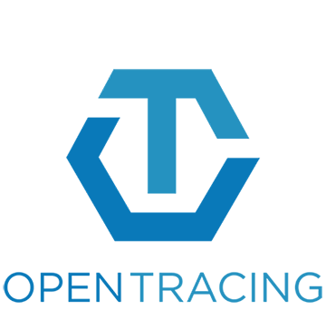
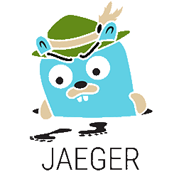

# Technical Overview

Before beginning with the workshop labs, we are going to learn more about distributed tracing, OpenTracing and Jaeger.

> Most of this content is taken directly from the official documentation.

## What is Distributed Tracing?

Distributed tracing is a set of tools and practices to monitor the health and reliability of a distributed application. A distributed application is an application that consists of multiple components that are deployed and operated separately. It is also known as micro-service.

The main concept behind distributed tracing is event correlation. Event correlation is a way to correlate events from one component to the events from another. It allows to find the cause-and-effect relationship between these events. For instance - find which user action in a browser caused a failure in the business logic layer.

To correlate events between components, these components need to exchange and store a piece of information called context. Typically context consists of an originating event identifier, an originating component identity and other event properties. Context has two parts. The first part is a trace context. Trace context consists of properties crucial for event correlation. The second part is baggage. Baggage carries user-defined properties. These properties may be helpful for correlation scenarios. But they are not required and components may choose to not carry or store them.

## Why should we use it?

IT and DevOps teams can use distributed tracing to monitor applications. Distributed tracing is particularly well-suited to debugging and monitoring modern distributed software architectures, such as microservices.

Developers can use distributed tracing to help debug and optimize their code.

## OpenTracing



> Last year, [OpenTelemetry](https://opentelemetry.io/) was announced as a new CNCF sandbox project resulting from a merger of **OpenTracing** and **OpenCensus**.

In order to understand what OpenTracing is, it is probably easier to start with what OpenTracing is NOT.

- OpenTracing is not a download or a program. Distributed tracing requires that software developers add instrumentation to the code of an application, or to the frameworks used in the application.
- OpenTracing is not a standard. The Cloud Native Computing Foundation (CNCF) is not an official standards body. The OpenTracing API project is working towards creating more standardized APIs and instrumentation for distributed tracing.

OpenTracing is comprised of an API specification, frameworks and libraries that have implemented the specification, and documentation for the project.

OpenTracing allows developers to add instrumentation to their application code using APIs that do not lock them into any one particular product or vendor.

### Concepts

**Traces** in OpenTracing are defined implicitly by their **Spans**. In particular, a **Trace** can be thought of as a directed acyclic graph (DAG) of **Spans**, where the edges between **Spans** are called **References**.

For example, the following is an example **Trace** made up of 8 **Spans**:

```other
Causal relationships between Spans in a single Trace


        [Span A]  ←←←(the root span)
            |
     +------+------+
     |             |
 [Span B]      [Span C] ←←←(Span C is a `ChildOf` Span A)
     |             |
 [Span D]      +---+-------+
               |           |
           [Span E]    [Span F] >>> [Span G] >>> [Span H]
                                       ↑
                                       ↑
                                       ↑
                         (Span G `FollowsFrom` Span F)

```

Sometimes it's easier to visualize **Traces** with a time axis as in the diagram below:

```other
Temporal relationships between Spans in a single Trace


--|-------|-------|-------|-------|-------|-------|-------|-> time

 [Span A···················································]
   [Span B··············································]
      [Span D··········································]
    [Span C········································]
         [Span E·······]        [Span F··] [Span G··] [Span H··]
```

#### Span

Each **Span** encapsulates the following state:

- An operation name.
- A start timestamp.
- A finish timestamp.
- A set of zero or more key:value **Span Tags**. The keys must be strings. The values may be strings, bools, or numeric types.
- A set of zero or more **Span Logs**, each of which is itself a key:value map paired with a timestamp. The keys must be strings, though the values may be of any type. Not all OpenTracing implementations must support every value type.
- A **SpanContext**.
- **References** to zero or more causally-related **Spans** (via the **SpanContext** of those related **Spans**).

Each **SpanContext** encapsulates the following state:

- Any OpenTracing-implementation-dependent state (for example, trace and span ids) needed to refer to a distinct **Span** across a process boundary
- **Baggage Items**, which are just key:value pairs that cross process boundaries

Span example:

```other
    t=0            operation name: db_query               t=x

     +-----------------------------------------------------+
     | · · · · · · · · · ·    Span     · · · · · · · · · · |
     +-----------------------------------------------------+

Tags:
- db.instance:"customers"
- db.statement:"SELECT * FROM mytable WHERE foo='bar'"
- peer.address:"mysql://127.0.0.1:3306/customers"

Logs:
- message:"Can't connect to mysql server on '127.0.0.1'(10061)"

SpanContext:
- trace_id:"abc123"
- span_id:"xyz789"
- Baggage Items:
  - special_id:"vsid1738"
```

#### Tracer

A **Tracer interface** creates **Spans** and understands how to **Inject** (serialize) and **Extract** (deserialize) their metadata across process boundaries. It has the following capabilities:

- Start a new Span.
- Inject a SpanContext into a carrier.
- Extract a SpanContext from a carrier.

A **Tracer** is the actual implementation that will record the Spans and publish them somewhere. How an application handles the actual Tracer is up to the developer: either consume it directly throughout the application or store it in the GlobalTracer for easier usage with instrumented frameworks.

Different Tracer implementations vary in how and what parameters they receive at initialization time, such as:

- Component name for this application’s traces.
- Tracing endpoint.
- Tracing credentials.
- Sampling strategy.
- Once a Tracer instance is obtained, it can be used to manually create Span, or pass it to existing instrumentation for frameworks and libraries.

In order to trace across process boundaries in distributed systems, services need to be able to continue the trace injected by the client that sent each request. OpenTracing allows this to happen by providing inject and extract methods that encode a span’s context into a carrier.


### Tracing Systems

As we said earlier Opentracing does not provide a specific implementation of tracing. Therefore, you must use a compatible Tracing System.

The following table lists all currently known OpenTracing Tracers:

| Tracing system                                | Supported languages                                |
|-----------------------------------------------|----------------------------------------------------|
| [CNCF Jaeger](https://www.jaegertracing.io/)  | Java,Go,Python,Node.js,C++,C#                      |
| [Datadog](https://www.datadoghq.com/)         | Go                                                 |
| [inspectIT](https://www.inspectit.rocks/)     | Java                                               |
| [Instana](https://www.instana.com/)           | Crystal,Go,Java,Node.js,Python,Ruby                |
| [LightStep](https://lightstep.com/)           | Go,Python,JavaScript,Objective-C,Java,PHP,Ruby,C++ |
| [stagemonitor](https://www.stagemonitor.org/) | Java                                               |

## Jaeger



Jaeger, inspired by [Dapper](https://research.google/pubs/pub36356/) and [OpenZipkin](http://zipkin.io), is a distributed tracing system released as open source by **Uber Technologies**.

It is used for monitoring and troubleshooting microservices-based distributed systems, including:

- Distributed context propagation
- Distributed transaction monitoring
- Root cause analysis
- Service dependency analysis
- Performance / latency optimization

### Features

- [OpenTracing](http://opentracing.io/) compatible data model and instrumentation libraries.
- Uses consistent upfront sampling with individual per service/endpoint probabilities.
- Multiple storage backends: Cassandra, Elasticsearch, memory.
- System topology graphs.

### Architecture

Jaeger can be deployed either as all-in-one binary, where all Jaeger backend components run in a single process, or as a scalable distributed system, discussed below.

There are two main deployment options:

1. Collectors are writing directly to storage.
  
2. Collectors are writing to Kafka as a preliminary buffer.
  

The most important components of Jaeger are:

- **Clients** are language specific implementations of the [OpenTracing API](https://opentracing.io). They can be used to instrument applications for distributed tracing either manually or with a variety of existing open source frameworks, such as Flask, Dropwizard, gRPC, and many more, that are already integrated with OpenTracing.
- **Agent** is a network daemon that listens for spans sent over UDP, which it batches and sends to the collector. It is designed to be deployed to all hosts as an infrastructure component. The agent abstracts the routing and discovery of the collectors away from the client.
- **Collector** receives traces from Jaeger agents and runs them through a processing pipeline. Currently our pipeline validates traces, indexes them, performs any transformations, and finally stores them. Jaeger's storage is a pluggable component which currently supports **Cassandra**, **Elasticsearch** and **Kafka**.
- **Query** is a service that retrieves traces from storage and hosts a UI to display them.
- **Ingester** is a service that reads from Kafka topic and writes to another storage backend (Cassandra, Elasticsearch).

### Sampling

Tracing every request has overhead in terms of application and large volumes of data. Therefore, Jaeger libraries implement consistent upfront (or head-based) sampling.

Jaeger libraries support the following samplers:

- **Constant** sampler always makes the same decision for all traces. It either samples all traces or none of them.
- **Probabilistic** sampler makes a random sampling decision with the probability of sampling equal to the value of sampler.param property.
- **Rate Limiting** sampler uses a leaky bucket rate limiter to ensure that traces are sampled with a certain constant rate.
- **Remote** sampler consults Jaeger agent for the appropriate sampling strategy to use in the current service. This allows controlling the sampling strategies in the services from a central configuration in Jaeger backend, or even dynamically (Adaptive Sampling).
